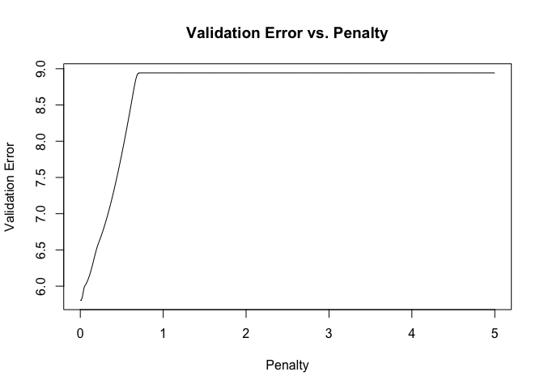
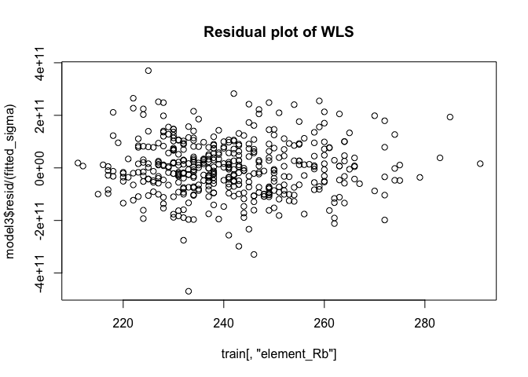

## Cleaning and Exploration


```r
data <- read.table("data/obsidian_data.txt", header = TRUE, sep = ",")
summary(data)
```

```
##       ID                 mass              type               site          
##  Length:652         Min.   :  0.0320   Length:652         Length:652        
##  Class :character   1st Qu.:  0.2125   Class :character   Class :character  
##  Mode  :character   Median :  0.4190   Mode  :character   Mode  :character  
##                     Mean   :  0.8777                                        
##                     3rd Qu.:  0.6925                                        
##                     Max.   :160.0000                                        
##                     NA's   :1                                               
##    element_Rb      element_Sr      element_Y       element_Zr   
##  Min.   :206.0   Min.   :10.00   Min.   :22.00   Min.   : 65.0  
##  1st Qu.:231.0   1st Qu.:45.00   1st Qu.:28.00   1st Qu.:326.0  
##  Median :240.0   Median :47.00   Median :29.00   Median :332.0  
##  Mean   :241.2   Mean   :46.95   Mean   :29.45   Mean   :331.9  
##  3rd Qu.:250.0   3rd Qu.:49.00   3rd Qu.:30.00   3rd Qu.:338.2  
##  Max.   :291.0   Max.   :65.00   Max.   :62.00   Max.   :365.0  
## 
```

After importing the data, we spot some interesting features in the data.

i) We see a repeated ID, which suggests that an object has been logged twice. 
ii) Mass has at least one huge outlier, as well as a missing (NA) value. 
iii) We see that there are too many types, and we will probably have to reduce the number of levels for our regression model to work.
iv) Most of the sites are either Ali Kosh or Chagha Shefid, but there is one uncertain site, and one site which matches neither of these two. 
v) Some of the Element data has significant outliers. 

Let us deal with these sequentially.

### ID

The repeated ID entry appears to be a double-logged entry, so we delete it. The alternative of not deleting it could produce overconfident standard error estimates (although this is just a single point, so the standard error estimate is unlikely to budge).


```r
data[which(data$ID == "288275.002bh"), ]
```

```
##              ID  mass  type     site element_Rb element_Sr element_Y element_Zr
## 32 288275.002bh 0.215 Blade Ali Kosh        252         49        32        339
## 33 288275.002bh 0.215 Blade Ali Kosh        254         48        31        339
```

```r
data <- data[-33,]
```

### Mass

The `mass` histogram exhibits an extremely large outlier - the 160 value is an order of magnitude above anything else, and the covariate values are not out of the ordinary. This indicates that this is a corrupted data point, so we delete it. (Note here that this is a slight selective inference problem, because we calculated the means of each of the covariates to observe that the covariate values of this corrupted point were not unusual.) 


```r
hist(data$mass)
```

<!-- -->

```r
data[which(data$mass >= 10), ]
```

```
##          ID mass  type         site element_Rb element_Sr element_Y element_Zr
## 465 297032q  160 Flake Chagha Sefid        214         41        27        312
```

```r
data <- data[-464,]
```

Upon removal of the outlier point, notice that the histogram has a severely skewed shape. Clearly, applying the log scale alleviates the skewedness.


```r
par(mfrow=c(1,2))
hist(data$mass)
hist(log(data$mass))
```

<!-- -->

```r
data$mass <- log(data$mass)
```

### Type

We should combine some of the type variables: blade and blades, etc; the classes do not seem very different, and they appear to be data entry anomalies. Furthermore, it seems necessary to collapse the levels since we may lose a lot of degrees of freedom from having a large number of levels in our data, which could be better used in our model selection and training. In sum, we have reduced to three levels: `Blade`, `Flake`, and `Core`. The full list of collapsed levels is available in the code snippet below. 

We did first consider Retouched Blades and Use Flakes to be a different category to Blades/Flakes, with an additional variable indicating Retouched or not and Used or not, but we had too few data points to make any reasonable model for this effect. 

Furthermore, if a data point is labeled ambiguously (e.g. `Core Fragment? Flake?`), we will never know the "correct" label. If we decide to coerce into one of the levels by looking at the data, then we are introducing selective inference problems.


```r
blade_type = c(
  "Blade", 
  "Distal end of prismatic blade?",
  "Blades",
  "Retouched blades",
  "Retouched Blade",
  "blade",
  "Retouched Blades"
)
flake_type = c(
  "Flake (listed as)",
  "flake",
  "Flake",
  "Used flake",
  "Flakes"
)
core_type = c(
  "Core fragment?",
  "Core fragment",
  "Fragment (from core?)",
  "Core",
  "Cores and frags",
  "core",
  "Cores and fragments",
  "Core/Fragment"
)

blade_data = data[which(data$type %in% blade_type),]
flake_data = data[which(data$type %in% flake_type),]
core_data = data[which(data$type %in% core_type),]

blade_data$type = "Blade"
flake_data$type = "Flake"
core_data$type = "Core"

data = rbind(blade_data, flake_data, core_data)
```


### Site

Now for the two site outliers. We considered training a logistic regression model to fit the uncertain site and the uncertain types, but realized that this would mean having to throw out used data points for our core model building. Therefore, we drop these data points, since we cannot impute by a normal regression for categorical variables. 


```r
data <- data[-which(data$site == "Ali Kosh/Chaga Sefid" | data$site == "Hulailan Tepe Guran"), ]
```

### Elements

We plot the histograms of the 4 elements and observe their distributions. 


```r
par(mfrow=c(2,2))
hist(data$element_Rb)
hist(data$element_Sr)
hist(data$element_Y)
hist(data$element_Zr)
```

<!-- -->

`element_Rb` looks reasonable, but the other elements have some outliers. For the same reason as outlined in the `mass` section, we delete the following outliers.


```r
data[which(data$element_Zr<100 | data$element_Y>50 | data$element_Sr<20), ]
```

```
##          ID       mass  type         site element_Rb element_Sr element_Y
## 628 297078L -2.6036902 Blade Chagha Sefid        234         35        62
## 652 297110b -0.7571525 Blade Chagha Sefid        215         10        23
##     element_Zr
## 628        303
## 652         65
```

```r
data <- data[-which(data$element_Zr<100 | data$element_Y>50 | data$element_Sr<20), ]
```

### NA values

Finally, we drop the NA entries in `mass` or `type` for the same concerns as outlined previously. This concludes our data cleaning. 


```r
data <- data[complete.cases(data[, c('mass', 'type')]), ]
```


```
##       ID                 mass            type               site    
##  Length:637         Min.   :-3.4420   Blade:390   Ali Kosh    :219  
##  Class :character   1st Qu.:-1.5512   Core : 24   Chagha Sefid:418  
##  Mode  :character   Median :-0.8604   Flake:223                     
##                     Mean   :-0.9094                                 
##                     3rd Qu.:-0.3682                                 
##                     Max.   : 2.2379                                 
##    element_Rb      element_Sr      element_Y       element_Zr   
##  Min.   :206.0   Min.   :39.00   Min.   :22.00   Min.   :307.0  
##  1st Qu.:231.0   1st Qu.:45.00   1st Qu.:28.00   1st Qu.:326.0  
##  Median :240.0   Median :47.00   Median :29.00   Median :332.0  
##  Mean   :241.3   Mean   :47.04   Mean   :29.41   Mean   :332.4  
##  3rd Qu.:250.0   3rd Qu.:49.00   3rd Qu.:30.00   3rd Qu.:338.0  
##  Max.   :291.0   Max.   :65.00   Max.   :34.00   Max.   :360.0
```


We next check the correlations among the continuous covariates. This can be further confirmed by plotting all the the continuous covariates against each other. Observe that all the continuous covariates are highly correlated with each other. This can be further confirmed by calculating the condition number of the design matrix (restricted to the continuous covariates) - the design matrix is clearly poorly conditioned, with a very wide range of values. Furthermore, we can regress each covariate onto the other covariates to obtain $R^2$ values. Observe that the nearly all the R-squared values are high; `element_Y` is the only one with a comparatively low R-squared value, indicating that it is "less" collinear. We will keep this observation in mind as we build our models. In general, one of our major concerns is battling multicollinearity. 


```r
cor(data[, cts_covs])
```

```
##            element_Rb element_Sr element_Y element_Zr
## element_Rb  1.0000000  0.8759472 0.7361899  0.8445656
## element_Sr  0.8759472  1.0000000 0.7281446  0.7857814
## element_Y   0.7361899  0.7281446 1.0000000  0.6153072
## element_Zr  0.8445656  0.7857814 0.6153072  1.0000000
```

```r
plot(data[, cts_covs], pch=20 , cex=1.0 , col="#69b3a2", main="Correlations between elements")
```

<!-- -->

```r
# condition number
cts_matrix = data.matrix(data[,cts_covs])
eigenvals = eigen(t(cts_matrix) %*% cts_matrix)
sqrt(eigenvals$val[1]/eigenvals$val)
```

```
## [1]   1.00000  56.71536 252.83502 381.34080
```


```r
# R-squared onto covariates
r_squared = rep(0,length(cts_covs))
for (i in 1:length(cts_covs)) {
  formula_string = paste(colnames(data)[cts_covs[i]], "~", paste(colnames(data)[cts_covs][-i], collapse="+"))
  model = lm(formula = formula_string, data=data)
  r_squared[i] = summary(model)$r.squared
}
r_squared
```

```
## [1] 0.8451380 0.7901858 0.5736697 0.7236041
```

## Model Building

To avoid selective inference problems, we split the data into training, validation, and test sets. 


```r
set.seed(2)

train_idx = sample(1:(dim(data)[1]), size=0.7*dim(data)[1])
train = data[train_idx,]
not_train = data[-train_idx,]
validate_idx = sample(1:(dim(not_train)[1]), size=0.5*dim(not_train)[1])
val = not_train[-validate_idx, ]
test = not_train[validate_idx,]
```

We first fit a simple model with no interaction terms. We cycle the order of the covariates to ask whether the categorical covariates are significant when compared against the full model.


```r
model0 = lm(formula = mass ~ element_Sr + element_Y + element_Rb + element_Zr + type + site, data=train)
anova(model0)
```

```
## Analysis of Variance Table
## 
## Response: mass
##             Df  Sum Sq Mean Sq  F value    Pr(>F)    
## element_Sr   1 174.175 174.175 467.4535 < 2.2e-16 ***
## element_Y    1   0.790   0.790   2.1203    0.1461    
## element_Rb   1  33.930  33.930  91.0619 < 2.2e-16 ***
## element_Zr   1  10.790  10.790  28.9579 1.209e-07 ***
## type         2  14.396   7.198  19.3178 9.136e-09 ***
## site         1  11.651  11.651  31.2692 3.964e-08 ***
## Residuals  437 162.828   0.373                       
## ---
## Signif. codes:  0 '***' 0.001 '**' 0.01 '*' 0.05 '.' 0.1 ' ' 1
```

```r
model0 = lm(formula = mass ~ element_Sr + element_Y + element_Rb + element_Zr + site + type, data=train)
anova(model0)
```

```
## Analysis of Variance Table
## 
## Response: mass
##             Df  Sum Sq Mean Sq  F value    Pr(>F)    
## element_Sr   1 174.175 174.175 467.4535 < 2.2e-16 ***
## element_Y    1   0.790   0.790   2.1203    0.1461    
## element_Rb   1  33.930  33.930  91.0619 < 2.2e-16 ***
## element_Zr   1  10.790  10.790  28.9579 1.209e-07 ***
## site         1  12.327  12.327  33.0845 1.661e-08 ***
## type         2  13.719   6.860  18.4101 2.107e-08 ***
## Residuals  437 162.828   0.373                       
## ---
## Signif. codes:  0 '***' 0.001 '**' 0.01 '*' 0.05 '.' 0.1 ' ' 1
```

```r
summary(model0)
```

```
## 
## Call:
## lm(formula = mass ~ element_Sr + element_Y + element_Rb + element_Zr + 
##     site + type, data = train)
## 
## Residuals:
##      Min       1Q   Median       3Q      Max 
## -2.44396 -0.37600 -0.02023  0.37740  2.57116 
## 
## Coefficients:
##                   Estimate Std. Error t value Pr(>|t|)    
## (Intercept)       0.768101   1.420653   0.541  0.58901    
## element_Sr       -0.076213   0.018222  -4.183 3.48e-05 ***
## element_Y         0.082413   0.028772   2.864  0.00438 ** 
## element_Rb       -0.054441   0.005665  -9.610  < 2e-16 ***
## element_Zr        0.037144   0.006150   6.039 3.31e-09 ***
## siteChagha Sefid  0.362524   0.064830   5.592 3.96e-08 ***
## typeCore          0.977714   0.162351   6.022 3.65e-09 ***
## typeFlake         0.019245   0.061563   0.313  0.75473    
## ---
## Signif. codes:  0 '***' 0.001 '**' 0.01 '*' 0.05 '.' 0.1 ' ' 1
## 
## Residual standard error: 0.6104 on 437 degrees of freedom
## Multiple R-squared:  0.6015,	Adjusted R-squared:  0.5951 
## F-statistic: 94.21 on 7 and 437 DF,  p-value: < 2.2e-16
```


```r
plot_diagnostics(model0, train, c(3,2))
```

<!-- -->


```r
par(mfrow=c(2,2))
plot(model0)
```

<!-- -->

From the F-tests, we conclude that both the categorical covariates are significant in the full model i.e. there are significant differences between sites and also between object types. Furthermore, all the element covariates are significant, with `element_Rb` having the lowest p-value. 

The diagnostic plots signify that the model is reasonably good - in particular, the linearity and normality assumptions are reasonable, save for a few outliers in the QQ plot. This suggests that interaction terms are unnecessary since no signal seems to remain. Nonetheless, we will later test for pairwise comparisons. We first some immediate problems. Firstly, the data seems heteroskedastic, as indicated by the sloped scale-location plot and the various diagnostic plots. The scale-location line has an upward trend, and our diagnostic plots indicate that the variance is higher at lower values of the continuous covariates. Additionally, the Flake type exhibits higher mass variance in comparison to the Blade type. For potentially high leverage points, there is a large value for `element_Sr` and a small value for `element_Y`. We will address each of these issues in the following order: 

1. Outliers / high leverage points / influential points
2. Variable selection / multicollinearity considerations
3. Heteroskedasticity concerns

## Outliers / High Leverage / Influential Points

We first inspect the two points that we identified to be potentially high leverage. While the small point in `element_Y` does not have high leverage, the large point in `element_Sr` does. We save the index of this point to test for influentiality. 


```r
# leverage
X = model.matrix(model0)
lev = diag(X%*%solve(t(X)%*%X,t(X)))

par(mfrow=c(3,1))
plot(model0$fit, model0$residuals, cex=10*lev,
     xlab="Fitted values",
     ylab="Residuals",
     main="Residuals plot with leverage scores")
plot(train[,"element_Sr"], model0$residuals, cex=10*lev,
     xlab="element_Sr",
     ylab="Residuals")
plot(train[,"element_Y"], model0$residuals, cex=10*lev,
     xlab="element_Y",
     ylab="Residuals")
```

<!-- -->

```r
i1 = which.max(train[, "element_Sr"])
```

For outliers, we check the studentized residuals and apply the Bonferroni correction. Because the maximum studentized residual is less than the Bonferroni-corrected threshold, we conclude that there are no outlier points. This aligns with the diagnostic plots, as no egregious outliers are present. 


```r
# outliers

n=dim(train)[1]
df=summary(model0)$df[1]
print(paste0('Max studentized residual: ',max(abs(studres(model0)))))
```

```
## [1] "Max studentized residual: 4.3487463944235"
```

```r
tval = qt(1-0.05/2/n,df)
print(paste0('Bonferroni-adjusted threshold: ',tval))
```

```
## [1] "Bonferroni-adjusted threshold: 7.00248500367919"
```

Therefore, we have a single candidate for an influential point. We fit our original model with and without this point and observe how the fitted values change. Notice that the fitted values are almost identical, which indicates that the high leverage point is not influential enough to substantially change the model parameters. 


```r
model0_without_i1 = lm(formula = mass ~ element_Sr + element_Y + element_Rb + element_Zr + type + site, data=train[-i1,])

plot(model0$fitted.values[-i1], model0_without_i1$fitted.values,
     xlab="Fitted values w/ point",
     ylab="Fitted values w/o point",
     main="Model with point vs. Model without point")
abline(0,1, col=2)
legend("topleft", c("Identity line"), col=2, lty=1)
```

<!-- -->

```r
cor(model0$fitted.values[-i1], model0_without_i1$fitted.values)
```

```
## [1] 0.9998768
```

## Variable Selection and Multicollinearity

In order to reduce multicollinearity, we want to carefully select covariates to reduce the size of our model. To this end, we consider forward stepwise selection, and evaluate using the Bayesian Information Criterion (BIC). We use the `step` method. The `step` command runs forward stepwise variable selection - to be clear, it adds in categorical covariates not level-by-level, but by the whole covariate itself.  


```r
step(lm(mass ~ 1, data=train), direction='forward', scope=formula(model0), k=log(dim(train)[1]), trace=0)
```

```
## 
## Call:
## lm(formula = mass ~ element_Rb + site + element_Zr + type + element_Sr + 
##     element_Y, data = train)
## 
## Coefficients:
##      (Intercept)        element_Rb  siteChagha Sefid        element_Zr  
##          0.76810          -0.05444           0.36252           0.03714  
##         typeCore         typeFlake        element_Sr         element_Y  
##          0.97771           0.01925          -0.07621           0.08241
```

However, the forward stepwise method selected our original model! Hence, we remove covariates by hand and observe the model diagnostics of the simpler model(s). To see which covariates we should remove, we record the differences in the R-squared values of the larger and smaller models. For the model with the overall smallest change, we plot the diagnostic plots. 


```r
Rsq_changes = rep(summary(model0)$r.squared, length(cts_covs))

for (i in 1:length(cts_covs)) {
  formula_string = paste("mass ~ type + site + ", colnames(train)[cts_covs[i]])
  model = lm(formula = formula_string, data=train)
  Rsq_changes[i] = Rsq_changes[i] - summary(model)$r.squared
}

Rsq_changes
```

```
## [1] 0.04514843 0.08552306 0.21870971 0.23022396
```

The model with the smallest change in the R-squared has the three covariates `type`, `site`, and `element_Rb`. The diagnostics suggest that mostly everything stays the same. The R-squared value (both non-adjusted and adjusted) has decreased only slightly, which indicates that our model reduction was successful. We quickly check again for high leverage points and outliers, and declare that none are influential. 

An expected benefit to this smaller model is variance reduction. Even further, because the covariates are highly multicollinear, we expect not to trade off much bias either. 


```r
model1 = lm(mass ~ type + site + element_Rb, data=train)
summary(model1)
```

```
## 
## Call:
## lm(formula = mass ~ type + site + element_Rb, data = train)
## 
## Residuals:
##      Min       1Q   Median       3Q      Max 
## -2.98896 -0.39021 -0.00293  0.42436  2.45963 
## 
## Coefficients:
##                   Estimate Std. Error t value Pr(>|t|)    
## (Intercept)       9.359535   0.597533  15.664  < 2e-16 ***
## typeCore          0.900239   0.169554   5.309 1.75e-07 ***
## typeFlake         0.019677   0.064645   0.304    0.761    
## siteChagha Sefid  0.321410   0.067781   4.742 2.86e-06 ***
## element_Rb       -0.043578   0.002395 -18.195  < 2e-16 ***
## ---
## Signif. codes:  0 '***' 0.001 '**' 0.01 '*' 0.05 '.' 0.1 ' ' 1
## 
## Residual standard error: 0.6419 on 440 degrees of freedom
## Multiple R-squared:  0.5563,	Adjusted R-squared:  0.5523 
## F-statistic: 137.9 on 4 and 440 DF,  p-value: < 2.2e-16
```

```r
plot_diagnostics(model1, train, c(3,1))
```

<!-- -->

```r
plot_model(model1)
```

<!-- -->

## Heteroskedasticity 

We initially observed heteroskedasticity in our plot, and were concerned about this. An unsuccessful attempt to fix this using variance modeling and weighted least squares is in the appendix. However, we realized that the nonconstant variance we were seeing on the plot was actually a trick. There were far more data points in the middle region of our data around 0. This meant that even if variance was constant, it would appear to be wider, since there were more chances for tail end events to occur here. This means that the constant variance assumption is more or less satisfied, even though it does not inititally appear so. 


## Model Selection

We first compare our large model with our small model using Monte Carlo validation. Monte Carlo cross-validation is a generalization of leave-one-out validation: if the dataset has size $n$, we first sample without replacement to obtain a training set of size $n_1$, then funnel the remaining $n-n_1$ points into the test set.


```r
mc_validation = function(trials, ratio, formula, data) {
  n = dim(data)[1]
  error = rep(0, trials)
  for (i in 1:trials) {
    
    training_idx = sample(1:n, size = round(ratio * n), replace = FALSE)
    training = data[training_idx, ]
    validation = data[-training_idx, ]
    
    model = lm(formula = formula, data=training)
    predictions = predict(model, validation)
    error[i] = sum((validation[, "mass"] - predictions)^2) / dim(validation)[1]
  } 
  
  return(sum(error) / trials)
}

paste("Validation Error (big model):", mc_validation(500, 0.8, formula(model0), train))
```

```
## [1] "Validation Error (big model): 0.389768821190994"
```

```r
paste("Validation Error (small model):", mc_validation(500, 0.8, formula(model1), train))
```

```
## [1] "Validation Error (small model): 0.421250561237836"
```

The larger model appears to perform better, but not by a massive margin. A small caveat here is that we are running validation on the training set, and we selected our models based on the training set. This indicates a selective inference problem, but for the purpose of model selection, the problem is alleviated by the use of Monte Carlo validation. 

Next, we bootstrap to obtain empirical estimates for the standard errors of the coefficient estimates of both models. For the larger model, the theoretical standard errors are consistently lower than the empirical estimates; for the smaller model, the theoretical standard errors are much closer to the empirical estimates, as expected. 


```r
bootstrap = function(trials, data, formula, coef) {
  n = dim(data)[1]
  beta_boot = rep(0, trials)
  SEbeta_boot = rep(0, trials)
  for (i in 1:trials){
    boot_sample = sample(n, n, replace=TRUE)
    model_boot = lm(formula=formula, data=data[boot_sample,])
    beta_boot[i] = model_boot$coefficients[coef]
    SEbeta_boot[i] = summary(model_boot)$coefficients[coef,2]
  }
  
  return(list("boot"=beta_boot, "SEboot"=SEbeta_boot))
}

hist_bootstrap = function(trials, data, model, fig_dim) {
  model_coefs = rownames(coef(summary(model)))[-1]
  
  par(mfrow=fig_dim, mar=c(1,1,3,1))
  for (i in 1:length(model_coefs)) {
    boot = bootstrap(trials, data, formula(model), model_coefs[i])
    hist(boot$boot, main = paste("Empirical SE(", model_coefs[i], "): ", round(sd(boot$boot), 3)))
    hist(boot$SEboot, main=paste("Mean Theo SE(", model_coefs[i], "):", round(mean(boot$SEboot), 3)))
  }
}

hist_bootstrap(100, train, model0, c(7,2))
```

<!-- -->

```r
hist_bootstrap(100, train, model1, c(4,2))
```

<!-- -->


## Conclusion


```r
model = lm(formula = mass ~ type + site + element_Rb, data=train)
predictions = predict(model, test)
error = sum(predictions - test$mass)^2 / dim(test)[1]

cis = predict(model, test, interval = "predict", level = 0.95)
upper = cis[, 2]
lower = cis[, 3]
plot(predictions, test$mass, ylab="True Value", xlab="Prediction", main="Model Prediction Accuracy")
abline(0,1, col=8)
polygon(x= predictions, y = upper, col = "blue",border = NA)
polygon(x= predictions, y = lower, col = "blue", border = NA)
legend("topright", c("95% prediction interval"), lty=1, col="blue")
```

<!-- -->

Our final model is `log(mass) ~ type + site + element_Rb`. Using the parameters from the training set, we obtain an out-of-sample error of 0.138. 

\newpage

## Appendix

### Influential point detection for small model

Our diagnostic plots for the smaller model indicate a few points that deviate from the trend quite drastically (e.g. points 103, 403). However, we do not expect these points to be influential because they lie roughly equidistant from the trend line and do not possess high leverage. Using the same quantitative method to check for outliers, no outliers could be detected. We can further check if the removal of both of these points changes the fitted values significantly. The fitted values are nearly the same regardless of the point removals. 


```r
# leverage
X = model.matrix(model1)
lev = diag(X%*%solve(t(X)%*%X,t(X)))

par(mfrow=c(3,1))
plot(model1$fit, model1$residuals, cex=10*lev)
plot(train[,"element_Sr"], model1$residuals, cex=10*lev)
plot(train[,"element_Y"], model1$residuals, cex=10*lev)
```

<!-- -->


```r
# outliers
n=dim(train)[1]
df=summary(model1)$df[1]
print(paste0('Max studentized residual: ',max(abs(studres(model1)))))
```

```
## [1] "Max studentized residual: 4.78875720110191"
```

```r
tval = qt(1-0.05/2/n,df)
print(paste0('Bonferroni-adjusted threshold: ',tval))
```

```
## [1] "Bonferroni-adjusted threshold: 10.9113059211514"
```

```r
par(mfrow=c(1,2))
plot(model1$fitted.values, model1$residuals,col="white")
text(model1$fitted.values, model1$residuals, as.character(1:dim(train)[1]))
plot(train[, "element_Rb"], model1$residuals, col="white")
text(train[, "element_Rb"], model1$residuals, as.character(1:dim(train)[1]))
```

<!-- -->


```r
remove_idx = c(193, 433)
model_temp = lm(formula = mass ~ element_Rb + type + site, data=train[-remove_idx,])

summary(model_temp)
```

```
## 
## Call:
## lm(formula = mass ~ element_Rb + type + site, data = train[-remove_idx, 
##     ])
## 
## Residuals:
##      Min       1Q   Median       3Q      Max 
## -1.95309 -0.38510 -0.00857  0.41852  1.80623 
## 
## Coefficients:
##                   Estimate Std. Error t value Pr(>|t|)    
## (Intercept)       9.209212   0.575305  16.008  < 2e-16 ***
## element_Rb       -0.043041   0.002305 -18.671  < 2e-16 ***
## typeCore          0.901286   0.162729   5.539 5.27e-08 ***
## typeFlake         0.022573   0.062247   0.363    0.717    
## siteChagha Sefid  0.352758   0.065334   5.399 1.10e-07 ***
## ---
## Signif. codes:  0 '***' 0.001 '**' 0.01 '*' 0.05 '.' 0.1 ' ' 1
## 
## Residual standard error: 0.616 on 438 degrees of freedom
## Multiple R-squared:  0.5776,	Adjusted R-squared:  0.5738 
## F-statistic: 149.8 on 4 and 438 DF,  p-value: < 2.2e-16
```


```r
plot(model1$fitted.values[-remove_idx], model_temp$fitted.values)
abline(0,1, col=2)
```

<!-- -->

```r
cor(model1$fitted.values[-remove_idx], model_temp$fitted.values)
```

```
## [1] 0.9997981
```

### Lasso regression

In order to reduce the effects of multicollinearity, we also tried lasso regression with various regularization parameters. We choose the best regularization parameter by doing Monte Carlo cross-validation. Unfortunately, lasso regression performs unsatisfactorily; there is no benefit to adding a penalty term because the validation error is monotonically increasing with increasing penalty. 

The more significant problem is that `glmnet` treats different dummy variables as different covariates altogether; for example, $\mathbb{1} \{ \text{type = Blade} \}$ is considered to be different from $\mathbb{1} \{ \text{type = Flake} \}$. This makes little sense; all the levels of a categorical predictor should be grouped together such that all or none of the levels are kept in the model (this is a similar problem to interpreting `summary()` versus `anova()`). Therefore, we elected not to use lasso for variable selection, but we have shown the results below for reference.


```r
mc_validation_lasso = function(trials, ratio, lambdas, data) {
  n = dim(data)[1]
  errors = rep(0, length(lambdas))
  
  for (i in 1:trials) {
    training_idx = sample(1:n, size = round(ratio * n), replace = FALSE)
    training = data[training_idx, ]
    validation = data[-training_idx, ]

    training_matrix = model.matrix(mass ~ type + site + element_Rb + element_Sr + element_Y + element_Zr, data=training)
    validation_matrix = model.matrix(mass ~ type + site + element_Rb + element_Sr + element_Y + element_Zr, data=validation)
    
    model = glmnet(x = training_matrix, y = training[, 2], lambda = lambdas)
    betahat = rbind(model$a0,as.matrix(model$beta, nrow=8, ncol=length(lambdas)))[-2,]
    predictions = validation_matrix %*% betahat
    true_value = matrix(validation[, 2], nrow = length(validation[, 2]), ncol = length(lambdas), byrow=FALSE)
    differences = predictions - true_value
    errors = errors + sqrt(colSums(differences^2))
  } 
  
  return(rev(errors / trials))
}

lambdas = seq(0, 5, 0.01)
trials = 100
training_test_ratio = 0.8

plot(lambdas, mc_validation_lasso(trials, training_test_ratio, lambdas, train), 
     type='l',
     main = "Validation Error vs. Penalty",
     xlab = "Penalty",
     ylab = "Validation Error")
```

<!-- -->

## Heteroskedastic Trial & Error

In order to accommodate for possibly differing variances, we consider modeling the variance using the `element_Rb` data. However, weighted least squares does not bring any significant improvements.


```r
model3 = gls(model=mass ~ type + site + element_Rb, data=train, weight = varConstPower(1, form = ~ element_Rb))
fitted_sigma = (exp(model3$mod[[1]][[1]]) + (train[, "element_Rb"])^model3$mod[[1]][[2]])
plot(train[,"element_Rb"], model3$resid /(fitted_sigma), main="Residual plot of WLS")
```

<!-- -->

