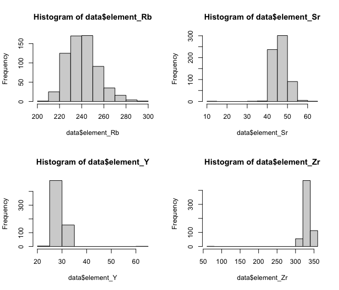
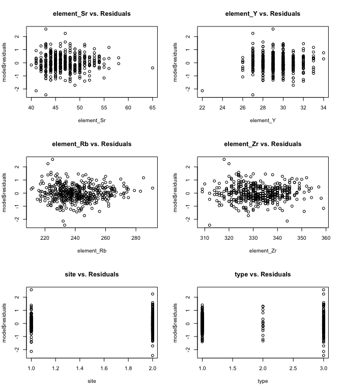
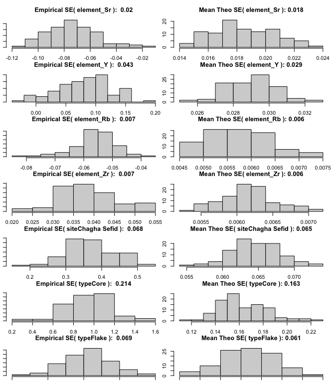

### Decision list

* For types, delete the entries that are ambiguous. For example, the ones that are like "Blade (Flake?)" or "Core fragment? Flake?". Reason: if labeled ambiguously, we will never know the "correct" label, and if we decide to coerce into one of the levels by looking at the data, then we are introducing selective inference problems. We only lose 9 data points (original: 652, modified: 643) - APPROVED

* For site, delete the two sites that are not Ali Kosh and Chagha Sefid. Reason: the label is ambiguous for the Ali Kosh / Chagha Sefid point, and for the Tepe point, there's only one point so it's not like we could derive any useful insights regarding that site anyway. We only lose two data points (original: 643, modified: 641) - APPROVED


In this project, we will analyze a dataset on Obsidian rocks, and try to build a working linear model for predicting the mass of a rock made of obsidian. 

Step 0: Importing the data and looking at it, trying to get a feel for it. 


```r
data <- read.table("data/obsidian_data.txt", header = TRUE, sep = ",")
```


```r
head(data, n=10)
```

```
##              ID  mass           type     site element_Rb element_Sr element_Y
## 1   288275.002a 0.502          Blade Ali Kosh        238         45        29
## 2  288275.002aa 0.227          Flake Ali Kosh        234         44        28
## 3  288275.002ab 0.188          Flake Ali Kosh        255         50        32
## 4  288275.002ac 0.153          Flake Ali Kosh        231         46        28
## 5  288275.002ad 0.102          Blade Ali Kosh        252         49        31
## 6  288275.002ae 0.440          Flake Ali Kosh        234         44        28
## 7  288275.002af 0.656          Blade Ali Kosh        226         44        28
## 8  288275.002ag 0.484          Flake Ali Kosh        230         45        29
## 9  288275.002ah 0.579          Blade Ali Kosh        230         44        28
## 10 288275.002ai 0.713 Core fragment? Ali Kosh        236         45        28
##    element_Zr
## 1         334
## 2         325
## 3         337
## 4         327
## 5         331
## 6         327
## 7         323
## 8         330
## 9         328
## 10        331
```

Data looks like it made it into R okay, so we can start analyzing it. 

Step 1: Data Exploration, cleaning, dealing with missing data. 


```r
summary(data)
```

```
##       ID                 mass              type               site          
##  Length:652         Min.   :  0.0320   Length:652         Length:652        
##  Class :character   1st Qu.:  0.2125   Class :character   Class :character  
##  Mode  :character   Median :  0.4190   Mode  :character   Mode  :character  
##                     Mean   :  0.8777                                        
##                     3rd Qu.:  0.6925                                        
##                     Max.   :160.0000                                        
##                     NA's   :1                                               
##    element_Rb      element_Sr      element_Y       element_Zr   
##  Min.   :206.0   Min.   :10.00   Min.   :22.00   Min.   : 65.0  
##  1st Qu.:231.0   1st Qu.:45.00   1st Qu.:28.00   1st Qu.:326.0  
##  Median :240.0   Median :47.00   Median :29.00   Median :332.0  
##  Mean   :241.2   Mean   :46.95   Mean   :29.45   Mean   :331.9  
##  3rd Qu.:250.0   3rd Qu.:49.00   3rd Qu.:30.00   3rd Qu.:338.2  
##  Max.   :291.0   Max.   :65.00   Max.   :62.00   Max.   :365.0  
## 
```

Already, we spot some interesting features: we see a repeated ID, making me suspect an object has been logged twice. There seems to be a missing mass value, as well a terribly wrong outlier on the high side. A few missing and a few uncertain types. An ambigious site which we should probably predict. Element Rb and Element Sr look fine, but Element Y seems to have an outlier on the high side, and Element Zr has a low side outlier. Let's look at these one by one. 


```r
data[which(data$ID == "288275.002bh"), ]
```

```
##              ID  mass  type     site element_Rb element_Sr element_Y element_Zr
## 32 288275.002bh 0.215 Blade Ali Kosh        252         49        32        339
## 33 288275.002bh 0.215 Blade Ali Kosh        254         48        31        339
```
This just looks like a double-logged entry, so I will simply delete it. 


```r
data <- data[-33,]
#commenting out so I do not run it again, but I ran it once. 
```
Now let us look at mass. I spot a few ourliers, so I will try to look at those. 
The 160 value is an order of magntude above anything else, so I just get rid of it, since I cannot fill in the value in any way.


```r
data[which(data$mass >= 10), ]
```

```
##          ID mass  type         site element_Rb element_Sr element_Y element_Zr
## 465 297032q  160 Flake Chagha Sefid        214         41        27        312
```

```r
#data[which(data$mass == NA), ] #no null values returned. 
```


```r
data <- data[-464,]
#commenting out so I do not run it again, but I ran it once. 
```
I also get rid of the NA value for mass, since I cannot impute for the regression output anyway


Now I plot the histogram of masses to see what kind of distribution it follows. 

```r
hist(data$mass)
```

<!-- -->
Clearly, this does not seem normal It might be worth putting some sort of transformation onto it: probably transforming it on a log scale, or other variable. We will see about this later, but take a note of this. 


```r
hist(log(data$mass))
```

<!-- -->
This looks pretty good so let's do it


```r
data$mass <- log(data$mass)
```


We should combine some of the type variables: blade and blades, etc. I feel pretty comfortable doing this, since all the errors seem to be for similar objects not and just logged differently by one person. 
Even if it is not perfect, it seems necessary to do since we cannot deal with that large a number of different types and simplifying to 2-3 kinds of terms helps us save degrees of freedom for other considerations later.
I first considered Retouched Blades being a different category to blades, but there are only 3 data points, which means even if they are differnet, they won't contribute much to a differnt effect, so I should just combine with Blade. Same with Used Flake to Flake.

```r
levels(data$type)
```

```
## NULL
```


```r
# data$type[data$type == "Blades"] <- "Blade"
# data$type[data$type == "blade"] <- "Blade"
# data$type[data$type == "Distal end of prismatic blade?"] <- "Blade"
# 
# data$type[data$type == "flake"] <- "Flake"
# data$type[data$type == "Flakes"] <- "Flake"
# data$type[data$type == "Flake (listed as)"] <- "Flake"
# 
# data$type[data$type == "core"] <- "Core"
# data$type[data$type == "Cores and frags"] <- "Core"
# data$type[data$type == "Core/Fragment"] <- "Core"
# data$type[data$type == "Core fragment"] <- "Core"
# data$type[data$type == "Core fragment?"] <- "Core"
# data$type[data$type == "Cores and fragments"] <- "Core"
# data$type[data$type ==  "Fragment (from core?)"] <- "Core"
# 
# data$type[data$type == "Retouched blades"] <- "Retouched Blade" 
# data$type[data$type == "Retouched Blades"] <- "Retouched Blade"     
# 
# data$type[data$type == "Retouched Blade"] <- "Blade" 
# data$type[data$type == "Used flake"] <- "Flake" 

data <- data[-which(data$type ==  "Blade (Flake?)"),]
data <- data[-which(data$type ==  "Core fragment? Flake?"),]
data <- data[-which(data$type ==  "Fragment (from core?)"),]

blade_type = c(
  "Blade", 
  "Distal end of prismatic blade?",
  "Blades",
  "Retouched blades",
  "Retouched Blade",
  "blade",
  "Retouched Blades"
)
flake_type = c(
  "Flake (listed as)",
  "flake",
  "Flake",
  "Used flake",
  "Flakes"
)
core_type = c(
  "Core fragment?",
  "Core fragment",
  "Fragment (from core?)",
  "Core",
  "Cores and frags",
  "core",
  "Cores and fragments",
  "Core/Fragment"
)

blade_data = data[which(data$type %in% blade_type),]
flake_data = data[which(data$type %in% flake_type),]
core_data = data[which(data$type %in% core_type),]

blade_data$type = "Blade"
flake_data$type = "Flake"
core_data$type = "Core"

data = rbind(blade_data, flake_data, core_data)
```


```r
unique(data$type)
```

```
## [1] "Blade" "Flake" "Core"
```

Also, we drop the NA entry in mass or type


```r
data <- data[complete.cases(data[, c('mass', 'type')]), ]
```


Now for the two site outliers. 

```r
data <- data[-which(data$site == "Ali Kosh/Chaga Sefid" | data$site == "Hulailan Tepe Guran"), ]
```

<!-- For the first one, we know that we just need to pick Ali Kosh/Chaga Sefid as its location, which we will do by imputing by mean. For the latter, we can either get rid of it and restrict our model to two sites, or try to learn which site looks more like Hulailan Tepe Guran. I will opt to do the latter.  -->

Now I am just going to plot the histograms of the 4 elements and see what the distribution looks like. 


```r
hist(data$element_Rb)
```

<!-- -->

```r
hist(data$element_Sr)
```

<!-- -->

```r
hist(data$element_Y)
```

<!-- -->

```r
hist(data$element_Zr)
```

<!-- -->

Rb looks fine, but I think the others have outliers we can get rid of, which are probably just mis-entered data. 


```r
data[which(data$element_Zr<100 | data$element_Y>50 | data$element_Sr<20), ]
```

```
##          ID       mass  type         site element_Rb element_Sr element_Y
## 628 297078L -2.6036902 Blade Chagha Sefid        234         35        62
## 652 297110b -0.7571525 Blade Chagha Sefid        215         10        23
##     element_Zr
## 628        303
## 652         65
```
I will just delete these two


```r
data <- data[-which(data$element_Zr<100 | data$element_Y>50 | data$element_Sr<20), ]
```


```r
summary(data)
```

```
##       ID                 mass             type               site          
##  Length:636         Min.   :-3.4420   Length:636         Length:636        
##  Class :character   1st Qu.:-1.5524   Class :character   Class :character  
##  Mode  :character   Median :-0.8604   Mode  :character   Mode  :character  
##                     Mean   :-0.9092                                        
##                     3rd Qu.:-0.3678                                        
##                     Max.   : 2.2379                                        
##    element_Rb      element_Sr      element_Y       element_Zr   
##  Min.   :206.0   Min.   :39.00   Min.   :22.00   Min.   :307.0  
##  1st Qu.:231.0   1st Qu.:45.00   1st Qu.:28.00   1st Qu.:326.0  
##  Median :240.5   Median :47.00   Median :29.00   Median :332.0  
##  Mean   :241.3   Mean   :47.03   Mean   :29.41   Mean   :332.4  
##  3rd Qu.:250.0   3rd Qu.:49.00   3rd Qu.:30.00   3rd Qu.:338.0  
##  Max.   :291.0   Max.   :65.00   Max.   :34.00   Max.   :360.0
```

The data looks clean-ish now. 

Note: note that we considered imputing by regression using a logistic regression model, but seemed too stenuous. 

<!-- So we move onto Step 3, inserting missing data or uncertain data. We have some NAs to fill in, as well as some uncertain types and sites which we will impute by mean. -->

<!-- For the sites, we see that the uncertain objects are both blades, so compare their masses to the masses of the blades found at the two common sites.  -->

<!-- ```{r} -->
<!-- mean(data[which(data$site == "Ali Kosh" & data$type == "Blade"), ]$mass) -->
<!-- mean(data[which(data$site == "Chagha Sefid" & data$type == "Blade"), ]$mass) -->
<!-- ``` -->
<!-- Both of the two uncertain sites seem closer to the mean of Ali Kosh, so I will reassign them there.  -->

<!-- ```{r} -->
<!-- data$site[data$site == "Ali Kosh/Chaga Sefid" | data$site == "Hulailan Tepe Guran"] <- "Ali Kosh" -->
<!-- ``` -->

<!-- Now, we do the same for the uncertain types.  -->


<!-- ```{r} -->
<!-- mean(data[which(data$type == "Blade"), ]$mass) -->
<!-- mean(data[which(data$type == "Flake"), ]$mass) -->
<!-- mean(data[which(data$type == "Core"), ]$mass) -->
<!-- ``` -->

<!-- ```{r} -->
<!-- data[which(data$type != "Blade" & data$type != "Flake" & data$type != "Core" ), ] -->
<!-- ``` -->
<!-- Manually assign them to the one their mean is closer to in the two choices.  -->

<!-- ```{r} -->
<!-- data$type[data$ID == "288275.002i"] <- "Flake" -->
<!-- data$type[data$ID == "288276c"] <- "Flake" -->
<!-- data$type[data$ID == "288276e"] <- "Flake" -->
<!-- data$type[data$ID == "288276f"] <- "Blade" -->
<!-- data$type[data$ID == "288284oL"] <- "Core" -->

<!-- ``` -->

<!-- With our missing/uncertain values imputed, let us look at the data for one last time. -->


```r
cat_covs = 3:4
cts_covs = 5:8

for (i in cat_covs) {
  data[, i] = as.factor(data[, i])
}

summary(data)
```

```
##       ID                 mass            type               site    
##  Length:636         Min.   :-3.4420   Blade:390   Ali Kosh    :219  
##  Class :character   1st Qu.:-1.5524   Core : 23   Chagha Sefid:417  
##  Mode  :character   Median :-0.8604   Flake:223                     
##                     Mean   :-0.9092                                 
##                     3rd Qu.:-0.3678                                 
##                     Max.   : 2.2379                                 
##    element_Rb      element_Sr      element_Y       element_Zr   
##  Min.   :206.0   Min.   :39.00   Min.   :22.00   Min.   :307.0  
##  1st Qu.:231.0   1st Qu.:45.00   1st Qu.:28.00   1st Qu.:326.0  
##  Median :240.5   Median :47.00   Median :29.00   Median :332.0  
##  Mean   :241.3   Mean   :47.03   Mean   :29.41   Mean   :332.4  
##  3rd Qu.:250.0   3rd Qu.:49.00   3rd Qu.:30.00   3rd Qu.:338.0  
##  Max.   :291.0   Max.   :65.00   Max.   :34.00   Max.   :360.0
```

Looks good!

Next, we check the correlations among the continuous covariates. This can be further confirmed by plotting all the the continuous covariates against each other. Observe that all the continuous covariates are highly correlated with each other. This can be further confirmed by calculating the variance inflation factor of the design matrix restricted to the continuous covariates - the design matrix is clearly poorly conditioned. 


```r
cor(data[, cts_covs])
```

```
##            element_Rb element_Sr element_Y element_Zr
## element_Rb  1.0000000  0.8778281 0.7363707  0.8456213
## element_Sr  0.8778281  1.0000000 0.7286295  0.7853497
## element_Y   0.7363707  0.7286295 1.0000000  0.6153247
## element_Zr  0.8456213  0.7853497 0.6153247  1.0000000
```

```r
plot(data[, cts_covs], pch=20 , cex=1.5 , col="#69b3a2")
```

<!-- -->

```r
# variance inflation factor
cts_matrix = data.matrix(data[,cts_covs])
eigenvals = eigen(t(cts_matrix) %*% cts_matrix)
sqrt(eigenvals$val[1]/eigenvals$val)
```

```
## [1]   1.00000  56.70774 254.83613 381.25933
```


## Model Building

To avoid selective inference problems, we split the data into training, validation, and test sets. 


```r
set.seed(2)

train_idx = sample(1:(dim(data)[1]), size=0.7*dim(data)[1])
train = data[train_idx,]
not_train = data[-train_idx,]
validate_idx = sample(1:(dim(not_train)[1]), size=0.5*dim(not_train)[1])
val = not_train[-validate_idx, ]
test = not_train[validate_idx,]
```

We first fit a simple model with no interaction terms. We cycle the order of the covariates in order to ask whether the categorical covariates are significant when compared against the full model. From the F-tests, we conclude that both the categorical covariates are significant in the full model i.e. there are significant differences between sites and also between object types.

The diagnostic plots signify that the model is reasonably good - in particular, the linearity and normality assumptions are reasonable, save for a few outliers in the QQ plot. However, the data appears to be heteroskedastic, as indicated by the sloped scale-location plot and the various diagnostic plots. 


```r
model0 = lm(formula = mass ~ element_Sr + element_Y + element_Rb + element_Zr + type + site, data=train)
anova(model0)
```

```
## Analysis of Variance Table
## 
## Response: mass
##             Df  Sum Sq Mean Sq  F value    Pr(>F)    
## element_Sr   1 173.054 173.054 499.9867 < 2.2e-16 ***
## element_Y    1   1.250   1.250   3.6117   0.05803 .  
## element_Rb   1  33.554  33.554  96.9441 < 2.2e-16 ***
## element_Zr   1   6.139   6.139  17.7381 3.080e-05 ***
## type         2  11.587   5.794  16.7391 9.893e-08 ***
## site         1  11.265  11.265  32.5475 2.147e-08 ***
## Residuals  437 151.253   0.346                       
## ---
## Signif. codes:  0 '***' 0.001 '**' 0.01 '*' 0.05 '.' 0.1 ' ' 1
```

```r
model0 = lm(formula = mass ~ element_Sr + element_Y + element_Rb + element_Zr + site + type, data=train)
anova(model0)
```

```
## Analysis of Variance Table
## 
## Response: mass
##             Df  Sum Sq Mean Sq  F value    Pr(>F)    
## element_Sr   1 173.054 173.054 499.9867 < 2.2e-16 ***
## element_Y    1   1.250   1.250   3.6117   0.05803 .  
## element_Rb   1  33.554  33.554  96.9441 < 2.2e-16 ***
## element_Zr   1   6.139   6.139  17.7381 3.080e-05 ***
## site         1  11.685  11.685  33.7610 1.202e-08 ***
## type         2  11.167   5.584  16.1323 1.739e-07 ***
## Residuals  437 151.253   0.346                       
## ---
## Signif. codes:  0 '***' 0.001 '**' 0.01 '*' 0.05 '.' 0.1 ' ' 1
```


```r
plot_diagnostics <- function(model, data) {
  par(mfrow=c(3,2))
  for (i in c(cat_covs, cts_covs)) {
    plot(data[, i], model$residuals, main=paste(colnames(data)[i], "vs. Residuals"))
  }
}

plot_model <- function(model) {
  par(mfrow=c(2,2))
  plot(model)
}

plot_diagnostics(model0, train)
```

<!-- -->


```r
par(mfrow=c(2,2))
plot(model0)
```

<!-- -->

Due to the high collinearity among the continuous covariates, we consider eliminating some of the continuous covariates via sparsity-inducing methods such as lasso regression. We should also consider ridge regression because for its coefficient stability properties. 


```r
model1 = glmnet(train[, c(cat_covs, cts_covs)], y = train[, 2], lambda = seq(0, 0.1, 0.01))
betahat = rbind(model1$a0, as.matrix(model1$beta, nrow=6, ncol=8))

betahat
```


```r
model3 = lm.ridge(formula = mass ~ element_Sr + element_Y + element_Rb + element_Zr + type + site, data=train, lambda=seq(0,10,0.5))
coef(model3)
```

```
##                element_Sr  element_Y  element_Rb element_Zr  typeCore
##  0.0 2.215070 -0.06282361 0.07086094 -0.05330874 0.03111232 0.8903131
##  0.5 2.290077 -0.06308378 0.06967895 -0.05285491 0.03069888 0.8895908
##  1.0 2.363748 -0.06333211 0.06851719 -0.05241096 0.03029319 0.8888612
##  1.5 2.436119 -0.06356910 0.06737511 -0.05197657 0.02989501 0.8881248
##  2.0 2.507226 -0.06379521 0.06625219 -0.05155143 0.02950412 0.8873819
##  2.5 2.577104 -0.06401089 0.06514789 -0.05113524 0.02912032 0.8866330
##  3.0 2.645786 -0.06421658 0.06406174 -0.05072771 0.02874339 0.8858783
##  3.5 2.713302 -0.06441268 0.06299325 -0.05032859 0.02837316 0.8851184
##  4.0 2.779685 -0.06459958 0.06194197 -0.04993760 0.02800943 0.8843534
##  4.5 2.844963 -0.06477765 0.06090746 -0.04955449 0.02765203 0.8835838
##  5.0 2.909164 -0.06494724 0.05988929 -0.04917903 0.02730077 0.8828098
##  5.5 2.972316 -0.06510869 0.05888705 -0.04881099 0.02695550 0.8820318
##  6.0 3.034446 -0.06526231 0.05790035 -0.04845014 0.02661606 0.8812499
##  6.5 3.095578 -0.06540843 0.05692880 -0.04809627 0.02628229 0.8804645
##  7.0 3.155737 -0.06554733 0.05597205 -0.04774918 0.02595404 0.8796758
##  7.5 3.214948 -0.06567929 0.05502972 -0.04740868 0.02563118 0.8788841
##  8.0 3.273232 -0.06580458 0.05410148 -0.04707457 0.02531356 0.8780895
##  8.5 3.330612 -0.06592345 0.05318700 -0.04674667 0.02500105 0.8772923
##  9.0 3.387109 -0.06603616 0.05228595 -0.04642481 0.02469353 0.8764927
##  9.5 3.442744 -0.06614293 0.05139803 -0.04610881 0.02439086 0.8756909
## 10.0 3.497537 -0.06624399 0.05052293 -0.04579853 0.02409294 0.8748871
##       typeFlake siteChagha Sefid
##  0.0 0.03419265        0.3549631
##  0.5 0.03435939        0.3547344
##  1.0 0.03452144        0.3545036
##  1.5 0.03467895        0.3542708
##  2.0 0.03483208        0.3540360
##  2.5 0.03498096        0.3537994
##  3.0 0.03512574        0.3535612
##  3.5 0.03526656        0.3533213
##  4.0 0.03540352        0.3530798
##  4.5 0.03553676        0.3528369
##  5.0 0.03566640        0.3525927
##  5.5 0.03579253        0.3523472
##  6.0 0.03591528        0.3521004
##  6.5 0.03603474        0.3518525
##  7.0 0.03615101        0.3516036
##  7.5 0.03626419        0.3513536
##  8.0 0.03637437        0.3511026
##  8.5 0.03648163        0.3508508
##  9.0 0.03658607        0.3505981
##  9.5 0.03668775        0.3503446
## 10.0 0.03678677        0.3500904
```


```r
model2 = lm(mass ~ element_Rb + type + site, data=train)
summary(model2)
```

```
## 
## Call:
## lm(formula = mass ~ element_Rb + type + site, data = train)
## 
## Residuals:
##     Min      1Q  Median      3Q     Max 
## -1.8089 -0.4037 -0.0063  0.4028  2.4364 
## 
## Coefficients:
##                   Estimate Std. Error t value Pr(>|t|)    
## (Intercept)       9.413791   0.571176  16.481  < 2e-16 ***
## element_Rb       -0.043814   0.002291 -19.121  < 2e-16 ***
## typeCore          0.791795   0.161910   4.890 1.41e-06 ***
## typeFlake         0.041783   0.061387   0.681    0.496    
## siteChagha Sefid  0.326521   0.064233   5.083 5.49e-07 ***
## ---
## Signif. codes:  0 '***' 0.001 '**' 0.01 '*' 0.05 '.' 0.1 ' ' 1
## 
## Residual standard error: 0.6099 on 440 degrees of freedom
## Multiple R-squared:  0.5783,	Adjusted R-squared:  0.5744 
## F-statistic: 150.8 on 4 and 440 DF,  p-value: < 2.2e-16
```

```r
plot_diagnostics(model2, train)
```

<!-- -->

```r
plot_model(model2)
```

<!-- -->


