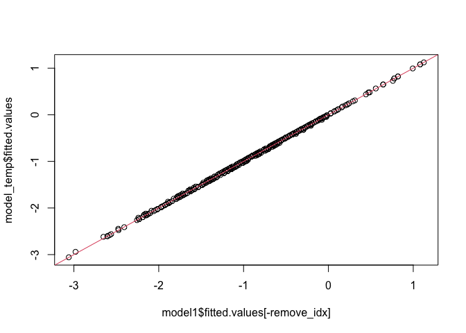

In this project, we will analyze a dataset on Obsidian rocks, and try to build a working linear model for predicting the mass of a rock made of obsidian. 

## Cleaning and Exploration


```r
data <- read.table("data/obsidian_data.txt", header = TRUE, sep = ",")
summary(data)
```

```
##       ID                 mass              type               site          
##  Length:652         Min.   :  0.0320   Length:652         Length:652        
##  Class :character   1st Qu.:  0.2125   Class :character   Class :character  
##  Mode  :character   Median :  0.4190   Mode  :character   Mode  :character  
##                     Mean   :  0.8777                                        
##                     3rd Qu.:  0.6925                                        
##                     Max.   :160.0000                                        
##                     NA's   :1                                               
##    element_Rb      element_Sr      element_Y       element_Zr   
##  Min.   :206.0   Min.   :10.00   Min.   :22.00   Min.   : 65.0  
##  1st Qu.:231.0   1st Qu.:45.00   1st Qu.:28.00   1st Qu.:326.0  
##  Median :240.0   Median :47.00   Median :29.00   Median :332.0  
##  Mean   :241.2   Mean   :46.95   Mean   :29.45   Mean   :331.9  
##  3rd Qu.:250.0   3rd Qu.:49.00   3rd Qu.:30.00   3rd Qu.:338.2  
##  Max.   :291.0   Max.   :65.00   Max.   :62.00   Max.   :365.0  
## 
```

<!-- ```{r} -->
<!-- head(data, n=10) -->
<!-- ``` -->

<!-- Data looks like it made it into R okay, so we can start analyzing it.  -->

<!-- Step 1: Data Exploration, cleaning, dealing with missing data.  -->


After importing the data, we spot some interesting features: we see a repeated ID, which suggests that an object has been logged twice. The mass data has a missing value and an extremely large value also. A few missing and a few uncertain types. An ambigious site which we should probably predict. Element Rb and Element Sr look fine, but Element Y seems to have an outlier on the high side, and Element Zr has a low side outlier. Let's look at these one by one. 


```r
data[which(data$ID == "288275.002bh"), ]
```

```
##              ID  mass  type     site element_Rb element_Sr element_Y element_Zr
## 32 288275.002bh 0.215 Blade Ali Kosh        252         49        32        339
## 33 288275.002bh 0.215 Blade Ali Kosh        254         48        31        339
```
This just looks like a double-logged entry, so I will simply delete it. 


```r
data <- data[-33,]
#commenting out so I do not run it again, but I ran it once. 
```
Now let us look at mass. I spot a few ourliers, so I will try to look at those. 
The 160 value is an order of magntude above anything else, so I just get rid of it, since I cannot fill in the value in any way.


```r
data[which(data$mass >= 10), ]
```

```
##          ID mass  type         site element_Rb element_Sr element_Y element_Zr
## 465 297032q  160 Flake Chagha Sefid        214         41        27        312
```

```r
#data[which(data$mass == NA), ] #no null values returned. 
```


```r
data <- data[-464,]
#commenting out so I do not run it again, but I ran it once. 
```
I also get rid of the NA value for mass, since I cannot impute for the regression output anyway


Now I plot the histogram of masses to see what kind of distribution it follows. 

```r
hist(data$mass)
```

<!-- -->
Clearly, this does not seem normal It might be worth putting some sort of transformation onto it: probably transforming it on a log scale, or other variable. We will see about this later, but take a note of this. 


```r
hist(log(data$mass))
```

<!-- -->
This looks pretty good so let's do it


```r
data$mass <- log(data$mass)
```


We should combine some of the type variables: blade and blades, etc. I feel pretty comfortable doing this, since all the errors seem to be for similar objects not and just logged differently by one person. 
Even if it is not perfect, it seems necessary to do since we cannot deal with that large a number of different types and simplifying to 2-3 kinds of terms helps us save degrees of freedom for other considerations later.
I first considered Retouched Blades being a different category to blades, but there are only 3 data points, which means even if they are differnet, they won't contribute much to a differnt effect, so I should just combine with Blade. Same with Used Flake to Flake.

```r
levels(data$type)
```

```
## NULL
```


```r
blade_type = c(
  "Blade", 
  "Distal end of prismatic blade?",
  "Blades",
  "Retouched blades",
  "Retouched Blade",
  "blade",
  "Retouched Blades"
)
flake_type = c(
  "Flake (listed as)",
  "flake",
  "Flake",
  "Used flake",
  "Flakes"
)
core_type = c(
  "Core fragment?",
  "Core fragment",
  "Fragment (from core?)",
  "Core",
  "Cores and frags",
  "core",
  "Cores and fragments",
  "Core/Fragment"
)

blade_data = data[which(data$type %in% blade_type),]
flake_data = data[which(data$type %in% flake_type),]
core_data = data[which(data$type %in% core_type),]

blade_data$type = "Blade"
flake_data$type = "Flake"
core_data$type = "Core"

data = rbind(blade_data, flake_data, core_data)
```


```r
unique(data$type)
```

```
## [1] "Blade" "Flake" "Core"
```

Also, we drop the NA entry in mass or type


```r
data <- data[complete.cases(data[, c('mass', 'type')]), ]
```


Now for the two site outliers. 

```r
data <- data[-which(data$site == "Ali Kosh/Chaga Sefid" | data$site == "Hulailan Tepe Guran"), ]
```

<!-- For the first one, we know that we just need to pick Ali Kosh/Chaga Sefid as its location, which we will do by imputing by mean. For the latter, we can either get rid of it and restrict our model to two sites, or try to learn which site looks more like Hulailan Tepe Guran. I will opt to do the latter.  -->

Now I am just going to plot the histograms of the 4 elements and see what the distribution looks like. 


```r
hist(data$element_Rb)
```

<!-- -->

```r
hist(data$element_Sr)
```

<!-- -->

```r
hist(data$element_Y)
```

<!-- -->

```r
hist(data$element_Zr)
```

<!-- -->

Rb looks fine, but I think the others have outliers we can get rid of, which are probably just mis-entered data. 


```r
data[which(data$element_Zr<100 | data$element_Y>50 | data$element_Sr<20), ]
```

```
##          ID       mass  type         site element_Rb element_Sr element_Y
## 628 297078L -2.6036902 Blade Chagha Sefid        234         35        62
## 652 297110b -0.7571525 Blade Chagha Sefid        215         10        23
##     element_Zr
## 628        303
## 652         65
```
I will just delete these two 


```r
data <- data[-which(data$element_Zr<100 | data$element_Y>50 | data$element_Sr<20), ]
```


```r
summary(data)
```

```
##       ID                 mass             type               site          
##  Length:637         Min.   :-3.4420   Length:637         Length:637        
##  Class :character   1st Qu.:-1.5512   Class :character   Class :character  
##  Mode  :character   Median :-0.8604   Mode  :character   Mode  :character  
##                     Mean   :-0.9094                                        
##                     3rd Qu.:-0.3682                                        
##                     Max.   : 2.2379                                        
##    element_Rb      element_Sr      element_Y       element_Zr   
##  Min.   :206.0   Min.   :39.00   Min.   :22.00   Min.   :307.0  
##  1st Qu.:231.0   1st Qu.:45.00   1st Qu.:28.00   1st Qu.:326.0  
##  Median :240.0   Median :47.00   Median :29.00   Median :332.0  
##  Mean   :241.3   Mean   :47.04   Mean   :29.41   Mean   :332.4  
##  3rd Qu.:250.0   3rd Qu.:49.00   3rd Qu.:30.00   3rd Qu.:338.0  
##  Max.   :291.0   Max.   :65.00   Max.   :34.00   Max.   :360.0
```

The data looks clean-ish now. 

Note: note that we considered imputing by regression using a logistic regression model, but seemed too stenuous. 


```r
cat_covs = 3:4
cts_covs = 5:8

for (i in cat_covs) {
  data[, i] = as.factor(data[, i])
}

summary(data)
```

```
##       ID                 mass            type               site    
##  Length:637         Min.   :-3.4420   Blade:390   Ali Kosh    :219  
##  Class :character   1st Qu.:-1.5512   Core : 24   Chagha Sefid:418  
##  Mode  :character   Median :-0.8604   Flake:223                     
##                     Mean   :-0.9094                                 
##                     3rd Qu.:-0.3682                                 
##                     Max.   : 2.2379                                 
##    element_Rb      element_Sr      element_Y       element_Zr   
##  Min.   :206.0   Min.   :39.00   Min.   :22.00   Min.   :307.0  
##  1st Qu.:231.0   1st Qu.:45.00   1st Qu.:28.00   1st Qu.:326.0  
##  Median :240.0   Median :47.00   Median :29.00   Median :332.0  
##  Mean   :241.3   Mean   :47.04   Mean   :29.41   Mean   :332.4  
##  3rd Qu.:250.0   3rd Qu.:49.00   3rd Qu.:30.00   3rd Qu.:338.0  
##  Max.   :291.0   Max.   :65.00   Max.   :34.00   Max.   :360.0
```

Looks good!

Next, we check the correlations among the continuous covariates. This can be further confirmed by plotting all the the continuous covariates against each other. Observe that all the continuous covariates are highly correlated with each other. This can be further confirmed by calculating the condition number of the design matrix (restricted to the continuous covariates) - the design matrix is clearly poorly conditioned, with a very wide range of values. Furthermore, we can regress each covariate onto the other covariates to obtain $R^2$ values. Observe that the nearly all the R-squared values are fairly high; on the other hand, `element_Y` seems to have a lower R-squared value, indicating that it is "less" collinear. We will keep this observation in mind as we build our models. In general, one of our major concerns is battling multicollinearity. 


```r
cor(data[, cts_covs])
```

```
##            element_Rb element_Sr element_Y element_Zr
## element_Rb  1.0000000  0.8759472 0.7361899  0.8445656
## element_Sr  0.8759472  1.0000000 0.7281446  0.7857814
## element_Y   0.7361899  0.7281446 1.0000000  0.6153072
## element_Zr  0.8445656  0.7857814 0.6153072  1.0000000
```

```r
plot(data[, cts_covs], pch=20 , cex=1.0 , col="#69b3a2")
```

<!-- -->

```r
# condition number
cts_matrix = data.matrix(data[,cts_covs])
eigenvals = eigen(t(cts_matrix) %*% cts_matrix)
sqrt(eigenvals$val[1]/eigenvals$val)
```

```
## [1]   1.00000  56.71536 252.83502 381.34080
```

```r
# R-squared onto covariates
r_squared = rep(0,length(cts_covs))
for (i in 1:length(cts_covs)) {
  formula_string = paste(colnames(data)[cts_covs[i]], "~", paste(colnames(data)[cts_covs][-i], collapse="+"))
  print(formula_string)
  model = lm(formula = formula_string, data=data)
  print(summary(model))
  r_squared[i] = summary(model)$r.squared
}
```

```
## [1] "element_Rb ~ element_Sr+element_Y+element_Zr"
## 
## Call:
## lm(formula = formula_string, data = data)
## 
## Residuals:
##     Min      1Q  Median      3Q     Max 
## -46.919  -2.444   0.124   2.911  27.522 
## 
## Coefficients:
##              Estimate Std. Error t value Pr(>|t|)    
## (Intercept) -81.88037    9.58792  -8.540  < 2e-16 ***
## element_Sr    1.79478    0.11821  15.183  < 2e-16 ***
## element_Y     1.44067    0.19028   7.571 1.31e-13 ***
## element_Zr    0.59072    0.03861  15.298  < 2e-16 ***
## ---
## Signif. codes:  0 '***' 0.001 '**' 0.01 '*' 0.05 '.' 0.1 ' ' 1
## 
## Residual standard error: 5.404 on 633 degrees of freedom
## Multiple R-squared:  0.8451,	Adjusted R-squared:  0.8444 
## F-statistic:  1152 on 3 and 633 DF,  p-value: < 2.2e-16
## 
## [1] "element_Sr ~ element_Rb+element_Y+element_Zr"
## 
## Call:
## lm(formula = formula_string, data = data)
## 
## Residuals:
##     Min      1Q  Median      3Q     Max 
## -3.7874 -0.9714 -0.1060  0.6414 15.3679 
## 
## Coefficients:
##               Estimate Std. Error t value Pr(>|t|)    
## (Intercept) -20.503726   2.798652  -7.326 7.24e-13 ***
## element_Rb    0.148748   0.009797  15.183  < 2e-16 ***
## element_Y     0.377791   0.055199   6.844 1.82e-11 ***
## element_Zr    0.061815   0.012776   4.838 1.65e-06 ***
## ---
## Signif. codes:  0 '***' 0.001 '**' 0.01 '*' 0.05 '.' 0.1 ' ' 1
## 
## Residual standard error: 1.556 on 633 degrees of freedom
## Multiple R-squared:  0.7902,	Adjusted R-squared:  0.7892 
## F-statistic: 794.7 on 3 and 633 DF,  p-value: < 2.2e-16
## 
## [1] "element_Y ~ element_Rb+element_Sr+element_Zr"
## 
## Call:
## lm(formula = formula_string, data = data)
## 
## Residuals:
##     Min      1Q  Median      3Q     Max 
## -8.7779 -0.6898 -0.0506  0.7052  3.7614 
## 
## Coefficients:
##              Estimate Std. Error t value Pr(>|t|)    
## (Intercept) 11.951355   1.968793   6.070 2.20e-09 ***
## element_Rb   0.057641   0.007613   7.571 1.31e-13 ***
## element_Sr   0.182381   0.026648   6.844 1.82e-11 ***
## element_Zr  -0.015112   0.009019  -1.675   0.0943 .  
## ---
## Signif. codes:  0 '***' 0.001 '**' 0.01 '*' 0.05 '.' 0.1 ' ' 1
## 
## Residual standard error: 1.081 on 633 degrees of freedom
## Multiple R-squared:  0.5737,	Adjusted R-squared:  0.5716 
## F-statistic: 283.9 on 3 and 633 DF,  p-value: < 2.2e-16
## 
## [1] "element_Zr ~ element_Rb+element_Sr+element_Y"
## 
## Call:
## lm(formula = formula_string, data = data)
## 
## Residuals:
##      Min       1Q   Median       3Q      Max 
## -19.9801  -2.8629   0.1723   2.9479  22.1668 
## 
## Coefficients:
##              Estimate Std. Error t value Pr(>|t|)    
## (Intercept) 203.57802    3.71889  54.742  < 2e-16 ***
## element_Rb    0.45694    0.02987  15.298  < 2e-16 ***
## element_Sr    0.57695    0.11924   4.838 1.65e-06 ***
## element_Y    -0.29217    0.17438  -1.675   0.0943 .  
## ---
## Signif. codes:  0 '***' 0.001 '**' 0.01 '*' 0.05 '.' 0.1 ' ' 1
## 
## Residual standard error: 4.753 on 633 degrees of freedom
## Multiple R-squared:  0.7236,	Adjusted R-squared:  0.7223 
## F-statistic: 552.4 on 3 and 633 DF,  p-value: < 2.2e-16
```

```r
r_squared
```

```
## [1] 0.8451380 0.7901858 0.5736697 0.7236041
```

## Model Building

To avoid selective inference problems, we split the data into training, validation, and test sets. 


```r
set.seed(2)

train_idx = sample(1:(dim(data)[1]), size=0.7*dim(data)[1])
train = data[train_idx,]
not_train = data[-train_idx,]
validate_idx = sample(1:(dim(not_train)[1]), size=0.5*dim(not_train)[1])
val = not_train[-validate_idx, ]
test = not_train[validate_idx,]
```

We first fit a simple model with no interaction terms. We cycle the order of the covariates in order to ask whether the categorical covariates are significant when compared against the full model. 


```r
model0 = lm(formula = mass ~ element_Sr + element_Y + element_Rb + element_Zr + type + site, data=train)
anova(model0)
```

```
## Analysis of Variance Table
## 
## Response: mass
##             Df  Sum Sq Mean Sq  F value    Pr(>F)    
## element_Sr   1 174.175 174.175 467.4535 < 2.2e-16 ***
## element_Y    1   0.790   0.790   2.1203    0.1461    
## element_Rb   1  33.930  33.930  91.0619 < 2.2e-16 ***
## element_Zr   1  10.790  10.790  28.9579 1.209e-07 ***
## type         2  14.396   7.198  19.3178 9.136e-09 ***
## site         1  11.651  11.651  31.2692 3.964e-08 ***
## Residuals  437 162.828   0.373                       
## ---
## Signif. codes:  0 '***' 0.001 '**' 0.01 '*' 0.05 '.' 0.1 ' ' 1
```

```r
model0 = lm(formula = mass ~ element_Sr + element_Y + element_Rb + element_Zr + site + type, data=train)
anova(model0)
```

```
## Analysis of Variance Table
## 
## Response: mass
##             Df  Sum Sq Mean Sq  F value    Pr(>F)    
## element_Sr   1 174.175 174.175 467.4535 < 2.2e-16 ***
## element_Y    1   0.790   0.790   2.1203    0.1461    
## element_Rb   1  33.930  33.930  91.0619 < 2.2e-16 ***
## element_Zr   1  10.790  10.790  28.9579 1.209e-07 ***
## site         1  12.327  12.327  33.0845 1.661e-08 ***
## type         2  13.719   6.860  18.4101 2.107e-08 ***
## Residuals  437 162.828   0.373                       
## ---
## Signif. codes:  0 '***' 0.001 '**' 0.01 '*' 0.05 '.' 0.1 ' ' 1
```

```r
summary(model0)
```

```
## 
## Call:
## lm(formula = mass ~ element_Sr + element_Y + element_Rb + element_Zr + 
##     site + type, data = train)
## 
## Residuals:
##      Min       1Q   Median       3Q      Max 
## -2.44396 -0.37600 -0.02023  0.37740  2.57116 
## 
## Coefficients:
##                   Estimate Std. Error t value Pr(>|t|)    
## (Intercept)       0.768101   1.420653   0.541  0.58901    
## element_Sr       -0.076213   0.018222  -4.183 3.48e-05 ***
## element_Y         0.082413   0.028772   2.864  0.00438 ** 
## element_Rb       -0.054441   0.005665  -9.610  < 2e-16 ***
## element_Zr        0.037144   0.006150   6.039 3.31e-09 ***
## siteChagha Sefid  0.362524   0.064830   5.592 3.96e-08 ***
## typeCore          0.977714   0.162351   6.022 3.65e-09 ***
## typeFlake         0.019245   0.061563   0.313  0.75473    
## ---
## Signif. codes:  0 '***' 0.001 '**' 0.01 '*' 0.05 '.' 0.1 ' ' 1
## 
## Residual standard error: 0.6104 on 437 degrees of freedom
## Multiple R-squared:  0.6015,	Adjusted R-squared:  0.5951 
## F-statistic: 94.21 on 7 and 437 DF,  p-value: < 2.2e-16
```


```r
plot_diagnostics(model0, train)
```

<!-- -->


```r
par(mfrow=c(2,2))
plot(model0)
```

<!-- -->

From the F-tests, we conclude that both the categorical covariates are significant in the full model i.e. there are significant differences between sites and also between object types. Furthermore, all the element covariates are significant, with `element_Rb` having the lowest p-value. 

The diagnostic plots signify that the model is reasonably good - in particular, the linearity and normality assumptions are reasonable, save for a few outliers in the QQ plot. This suggests that interaction terms are unnecessary since no signal seems to remain. Nonetheless, we will later test for pairwise comparisons. We first some immediate problems. Firstly, the data appears to be heteroskedastic, as indicated by the sloped scale-location plot and the various diagnostic plots. The scale-location line has an upward trend, and our diagnostic plots indicate that the variance is higher at lower values of the continuous covariates (we expect less variability in the areas with few data points, and more variability in those with many data points). Additionally, the Flake type exhibits higher mass variance in comparison to the Blade type. For potentially high leverage points, there is a large value for `element_Sr` and a small value for `element_Y`. We will address each of these issues in the following order: 

1. Outliers / high leverage points / influential points
2. Variable selection / multicollinearity considerations
3. Variance stabilization using transformation and interactions terms

## Outliers / High Leverage / Influential Points

We first inspect the two points that we identified to be potentially high leverage. While the small point in `element_Y` does not have high leverage, the large point in `element_Sr` has high leverage. We save the index of this point to test for influentiality. 


```r
# leverage
X = model.matrix(model0)
lev = diag(X%*%solve(t(X)%*%X,t(X)))

par(mfrow=c(3,1))
plot(model0$fit, model0$residuals, cex=10*lev)
plot(train[,"element_Sr"], model0$residuals, cex=10*lev)
plot(train[,"element_Y"], model0$residuals, cex=10*lev)
```

<!-- -->

```r
i1 = which.max(train[, "element_Sr"])
```

For outliers, we check the studentized residuals and apply the Bonferroni correction. Because the maximum studentized residual is less than the Bonferroni-corrected threshold, we conclude that there are no outlier points. This aligns with the diagnostic plots, as no egregious outliers are present. 


```r
# outliers

n=dim(train)[1]
df=summary(model0)$df[1]
print(paste0('Max studentized residual: ',max(abs(studres(model0)))))
```

```
## [1] "Max studentized residual: 4.3487463944235"
```

```r
tval = qt(1-0.05/2/n,df)
print(paste0('Bonferroni-adjusted threshold: ',tval))
```

```
## [1] "Bonferroni-adjusted threshold: 7.00248500367919"
```

Therefore, we have a single candidate for an influential point. We fit our original model with and without this point and observe how the fitted values change. Notice that the fitted values are almost identical, which indicates that the high leverage point is not influential enough to substantially change the model parameters. 


```r
model0_without_i1 = lm(formula = mass ~ element_Sr + element_Y + element_Rb + element_Zr + type + site, data=train[-i1,])

plot(model0$fitted.values[-i1], model0_without_i1$fitted.values)
abline(0,1, col=2)
```

<!-- -->

```r
cor(model0$fitted.values[-i1], model0_without_i1$fitted.values)
```

```
## [1] 0.9998768
```

## Variable Selection and Multicollinearity

In order to reduce multicollinearity, we want to carefully select covariates to reduce the size of our model. To this end, we consider forward stepwise selection, and evaluate using the Bayesian Information Criterion (BIC) and a separate validation set. We use the `step` method. 


```r
step(lm(mass ~ 1, data=train), direction='forward', scope=formula(model0), trace=0)
```

```
## 
## Call:
## lm(formula = mass ~ element_Rb + type + site + element_Zr + element_Sr + 
##     element_Y, data = train)
## 
## Coefficients:
##      (Intercept)        element_Rb          typeCore         typeFlake  
##          0.76810          -0.05444           0.97771           0.01925  
## siteChagha Sefid        element_Zr        element_Sr         element_Y  
##          0.36252           0.03714          -0.07621           0.08241
```

However, the forward stepwise method selected our original model! With this, we remove covariates by hand and observe the model diagnostics of the simpler model(s). To see which covariates we should remove, we record the differences in the R-squared values of the larger and smaller models. For the model with the overall smallest change, we plot the diagnostic plots. 


```r
Rsq_changes = rep(summary(model0)$r.squared, length(cts_covs))

for (i in 1:length(cts_covs)) {
  formula_string = paste("mass ~ type + site + ", colnames(train)[cts_covs[i]])
  model = lm(formula = formula_string, data=train)
  Rsq_changes[i] = Rsq_changes[i] - summary(model)$r.squared
}

Rsq_changes
```

```
## [1] 0.04514843 0.08552306 0.21870971 0.23022396
```

The model with the smallest change in the R-squared considers the three covariates `type`, `site`, and `element_Rb`. The diagnostics suggest that mostly everything stays the same. The R-squared values (both non-adjusted and adjusted) and the residual sum of squares have decreased and increased respectively only slightly, which indicates that our model reduction was successful. Nonetheless, the heteroskedasticity persists.


```r
model1 = lm(mass ~ type + site + element_Rb, data=train)

plot_diagnostics(model1, train)
```

<!-- -->

```r
plot_model(model1)
```

<!-- -->

## Heteroskedasticity 


\newpage

## Appendix

### Lasso regression

In order to reduce the effects of multicollinearity, we also tried lasso regression with various regularization parameters. We choose the best regularization parameter by doing Monte Carlo cross-validation. Monte Carlo cross-validation is a generalization of leave-one-out validation: if the dataset has size $n$, we first sample without replacement to obtain a training set of size $n_1$, then funnel the remaining $n-n_1$ points into the test set. However, lasso regression performs unsatisfactorily; there is no benefit to adding a penalty term because the validation error is monotonically increasing with increasing penalty. 

The more significant problem is that `glmnet` treats different dummy variables as different covariates altogether; for example, $\mathbb{one} \{ \text{type = Blade} \}$ is considered to be different from $\mathbb{one} \{ \text{type = FLake} \}$. This makes little sense; all the levels of a categorical predictor should be grouped together such that all or none of the levels are kept in the model (this is a similar problem to interpreting `summary()` versus `anova()`). Therefore, we elected not to use lasso for variable selection, but we have shown the results below for reference.


```r
mc_validation = function(trials, ratio, lambdas, data) {
  n = dim(data)[1]
  errors = rep(0, length(lambdas))
  
  for (i in 1:trials) {
    training_idx = sample(1:n, size = round(ratio * n), replace = FALSE)
    training = data[training_idx, ]
    validation = data[-training_idx, ]

    training_matrix = model.matrix(mass ~ type + site + element_Rb + element_Sr + element_Y + element_Zr, data=training)
    validation_matrix = model.matrix(mass ~ type + site + element_Rb + element_Sr + element_Y + element_Zr, data=validation)
    
    model = glmnet(x = training_matrix, y = training[, 2], lambda = lambdas)
    betahat = rbind(model$a0,as.matrix(model$beta, nrow=8, ncol=length(lambdas)))[-2,]
    predictions = validation_matrix %*% betahat
    true_value = matrix(validation[, 2], nrow = length(validation[, 2]), ncol = length(lambdas), byrow=FALSE)
    differences = predictions - true_value
    errors = errors + sqrt(colSums(differences^2))
  } 
  
  return(rev(errors / trials))
}
lambdas = seq(0, 5, 0.01)
trials = 100
training_test_ratio = 0.8

plot(lambdas, mc_validation(trials, training_test_ratio, lambdas, train), 
     type='l',
     main = "Validation Error vs. Penalty",
     xlab = "Penalty",
     ylab = "Validation Error")
```

<!-- -->

